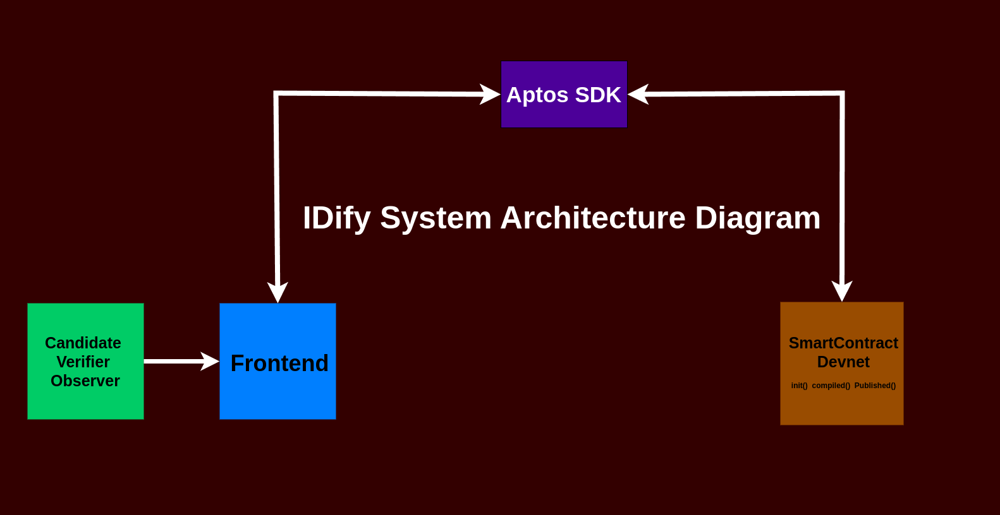

# 🪪 Idify – Decentralized Identity, Credentials & Reputation Protocol

> **Proof over Promises. Trust without Intermediaries. Welcome to Idify.**

**Idify** is a decentralized application (dApp) and protocol that redefines how resumes, credentials, and reputations are managed, verified, and trusted — all on-chain.

Once a candidate commits a credential (e.g., *"Graduated from IIT Delhi"*), it becomes **immutable**. Whether that claim is **credible** is determined **not by a central authority**, but by **verifiable attestations from HRs, employers, institutions, or community verifiers**.

Idify is your tamper-proof, censorship-resistant **Web3 resume protocol**, where **proof replaces trust**.

---

## ⚙️ Core Features

* 🧾 **Immutable Resume Claims**
  Users commit educational, professional, or skill-based claims that are **permanently stored** on-chain or IPFS (off-chain hashed).

* 🧠 **On-Chain Verifications**
  HRs, institutes, DAOs, or trusted entities can attach **verifications** through **attestations**, creating a decentralized trust graph.

* 🔍 **Verifiable Reputation System**
  Candidates build reputation based on how many **trusted verifiers** confirm their claims. No verification? The claim remains untrusted.

---

## 🔧 Upcoming Features

* 🫟 **DID & VC Friendly**
  Built with support for Decentralized Identifiers (DIDs) and Verifiable Credentials (VCs) to support global interoperability.

* 🪙 **Soulbound Tokens (SBTs)** (optional)
  Credentials can be minted as **non-transferable tokens**, unique to the user’s identity.

* 🛡️ **ZK Privacy (WIP)**
  Zero-Knowledge proof integration for **private credential verification** (e.g., “Graduated top 5%” without revealing GPA or school).

---

## 💼 Use Cases

* ✅ **Resume fraud protection** in hiring and recruitment.
* 🌍 **Global credential portability** across borders.
* 📜 **Academic certificate verification** for institutions and edtech.
* 🧑‍💻 **Decentralized freelance & DAO hiring**.
* 🛂 **Credential-based access systems** (e.g., for immigration, onboarding, or scholarships).

---

## 🚀 Quick Start

### 🔗 Prerequisites

* Node.js ≥ 18
* Install rust & cargo
* [Aptos Wallet](https://chromewebstore.google.com/detail/ejjladinnckdgjemekebdpeokbikhfci?utm_source=item-share-cb)
* Testnet/Devnet

### 🛠️ Install & Deploy

```bash
git clone https://github.com/your-org/idify.git
cd idify
npm install
```

#### Deploy Smart Contracts

```bash
aptos move init # Choose Devnet (Default)
aptos move compile
aptos move publish
```

#### Run Frontend

```bash
cd frontend
npm install
npm run dev
```

Open your browser at: [http://localhost:3000](http://localhost:3000)

---

## 🧱 Architecture

| Layer              | Stack / Tooling                       |
| ------------------ | ------------------------------------- |
| Smart Contracts    | Aptos & Move                          |
| Identity           | EIP-712, DIDs, Wallet Signatures      |
| Credential Storage | Local Storage (for now)               |
| Frontend           | React, plaincss, Material UI          |
| Verification       | Signature & Hashed-based Attestations |

---

## 👥 Actors

* **Candidate**: Makes claims about achievements (education, work, skills).
* **Verifier**: HR, employer, university, DAO, or trusted entity that confirms/attests.
* **Employer / Observer**: Consumes verified resume data for decision-making.

---

## 🧭 Reputation Logic

Each attestation adds to a **reputation graph**:

* ✅ More attestations = higher trust weight
* 🧹 Attestation weight varies by verifier's reputation (staking model in roadmap)
* 🕵️‍♀️ Unverified claims are visible but flagged

---

## 🗘️ System Interaction Diagram

 <!-- Replace with actual image path -->

### 🔄 Diagram Description

This diagram illustrates the core flow of how Idify interacts across layers:

1. **Frontend**: Initiates credential claim submissions and verification requests via user interaction.
2. **Aptos SDK**: Acts as a bridge for transaction signing and broadcasting.
3. **Smart Contracts (Devnet)**: Hosts core logic for claim commits, verification attestations, and trust aggregation.

The data pipeline follows this pattern:

```text
[Candidate / Verifier / Observer] → Frontend → Aptos SDK → SmartContract (init, commit, attest)
```
🧑‍💼 Real-World Example:

 - Step 1 – Candidate Action: Rajesh, a software engineer, uses the Idify frontend to submit a claim: "Worked at TCS from 2021–2023 as a Backend Developer".
 - Step 2 – On-Chain Submission: This claim is passed to the Aptos SDK, which signs the transaction using Rajesh’s wallet and sends it to the smart contract on Devnet.
 - Step 3 – Verifier Action: TCS HR logs into Idify, finds Rajesh’s claim, and attests to it using their verifier identity. The attestation is signed and recorded on-chain.
 - Step 4 – Reputation Building: Rajesh’s claim now has a trusted attestation, increasing his profile's trust level in the Idify ecosystem.

#### 📊 Sample Test Data (Devnet)

Here are sample records retrieved during internal testing:

| Name                 | Wallet                                                                                      | Claim                      | Verifier | Status       | Timestamp           | Tx Hash                                                                                       |
|----------------------|---------------------------------------------------------------------------------------------|----------------------------|----------|--------------|---------------------|------------------------------------------------------------------------------------------------|
| Shreejita Biswas     | 0x6b742055e3f5bdd6b97e034e6b1a31a1104171e80d4937491372e65a9941b78c                         | Data Analyst @ GNIT       | GNIT     | ✅ Verified   | 2025-07-06 09:20 AM | 0xcb90ed5b7225f82f599c39baeded343605b1be3b6b42580d48f9fc30c99710e9                            |
| Supratik Nath        | 0x6b742055e3f5bdd6b97e034e6b1a31a1104171e80d4937491372e65a9941b78c                         | Data Analyst @ GNIT       | GNIT     | ✅ Verified   | 2025-07-06 11:19 AM | 0xcebb1e53a10bdb8982e3436294e93878f4c07266978e7db779d6b12c1152eccf                            |
| Biswadeb Mukherjee   | 0x6b742055e3f5bdd6b97e034e6b1a31a1104171e80d4937491372e65a9941b78c                         | Ethical Hacker @ GNIT     | GNIT     | ✅ Verified   | 2025-07-06 07:19 AM | 0x8efbf04e25136f4cdb8f6b5775a5e97c536310040c0140e4142f25115f3b40b4                            |


Planned integrations like ZK-Proofs and DID/VC support will extend this architecture with privacy and interoperability layers.

---

## 🗌 Roadmap

* [x] Resume claim commits + attestation system (MVP)
* [ ] Verifier staking & reputation weighting
* [ ] Token-gated or DAO-governed verifier onboarding
* [ ] Zero-Knowledge credential proofs
* [ ] Verifiable Credential & DID support (Ceramic/Spruce)
* [ ] NFT badge display + QR code integrations
* [ ] Mobile App (React Native)

---

## Meet our Developer

| Name                   | Role                        | Contributions                                                                 |
| ---------------------- | --------------------------- | ----------------------------------------------------------------------------- |
| **Biswadeb Mukherjee** | Smart Contract Designer    | System architecture, smart contracts (Aptos/Move), reputation logic, security |
| **Shreejita Biswas**   | Team Lead-Frontend Developer        | UI/UX design, user flows, identity onboarding                                 |
| **Supratik Nath**      | Frontend Developer |   --                          |


## 🤝 Contributing

We welcome PRs, feature ideas, and feedback. If you're building in the DID/VC, DAO tooling, or ZK space, let's collaborate.

Please refer to `CONTRIBUTING.md` (coming soon).

---

## 📜 License

MIT License © 2025 Biswadeb Mukherjee

---

## 📡 Contact

Built with ❤️ by [@official-biswadeb941](https://github.com/official-biswadeb941)
For demos, partnerships, or integration, [open an issue](https://github.com/official-biswadeb941/idify/issues) or drop a line.

---

**Idify – Own Your Identity. Prove Your Worth. On Your Terms.**
